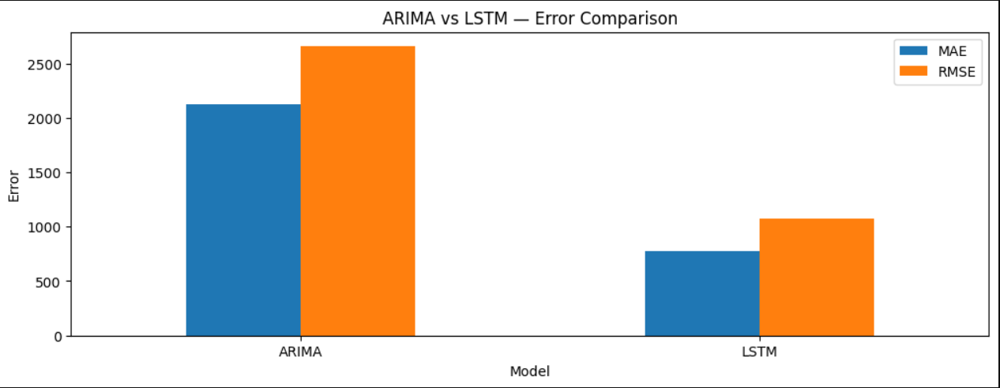
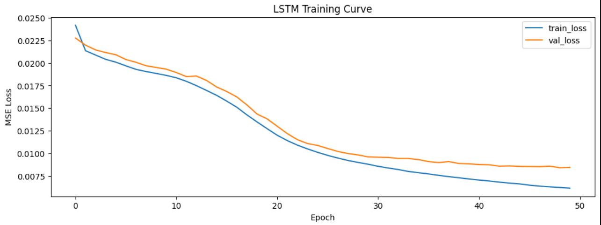
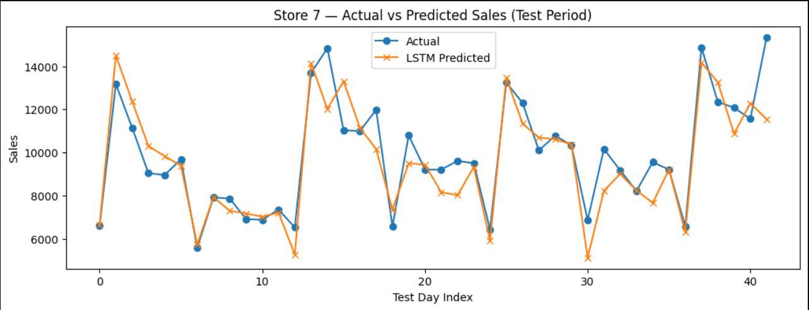
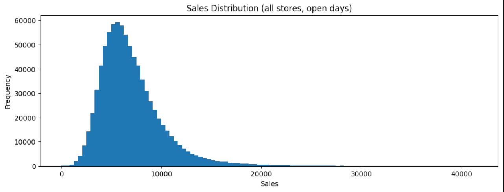
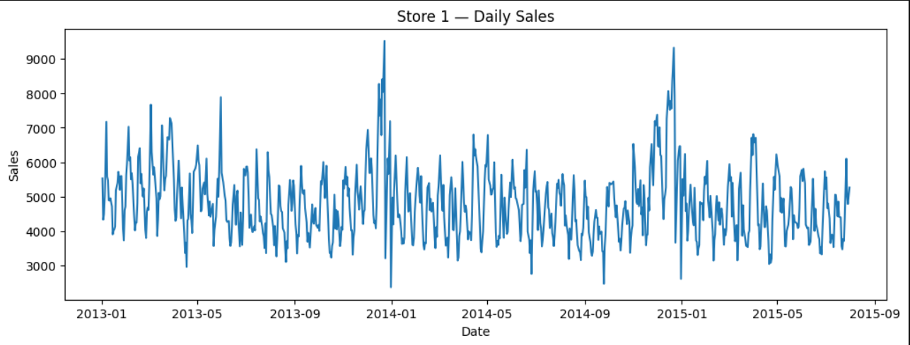
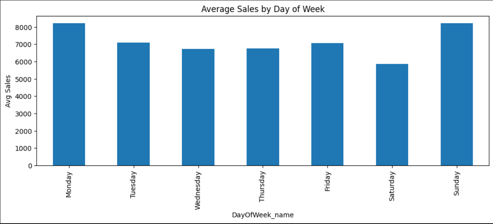
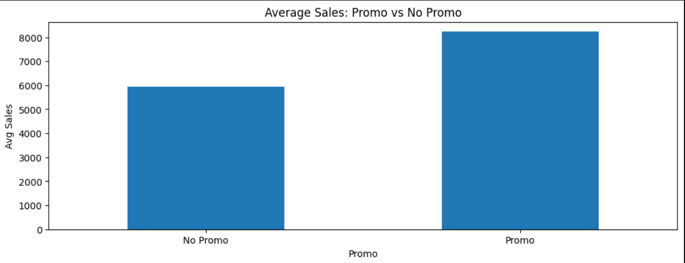

# Daily Retail Sales Forecasting — LSTM vs ARIMA

Forecasting daily store sales using a univariate LSTM on 30-day historical
windows, benchmarked against an ARIMA baseline on the Rossmann Store Sales
dataset.

## Overview

- **Goal:** Predict next-day store sales from the past 30 days of sales
  history, and compare performance against a classical ARIMA baseline.
- **Dataset:** [Rossmann Store Sales](https://www.kaggle.com/c/rossmann-store-sales)
  (Kaggle) — 3+ years of daily sales across 1,000+ stores, with promo and
  holiday indicators.
- **Approach:** Per-store scaling → 30-day sliding windows → LSTM
  (univariate) vs. ARIMA, evaluated on held-out test data (last ~6 weeks
  per store).

## Pipeline

1. **Data cleaning** — merge `train.csv` + `store.csv`, drop closed days,
   sort chronologically per store.
2. **EDA** — sales distribution, weekly seasonality, promo/holiday effects.
3. **Per-store scaling** — MinMax scaling fit independently per store
   (sales scale varies widely across stores).
4. **Windowing** — 30-day lookback windows built per store, time-based
   train/test split (last 42 days held out per store).
5. **Baseline model** — ARIMA (fixed order), fit per store.
6. **Main model** — 2-layer LSTM (64 → 32 units) on univariate sales
   sequences.
7. **Evaluation** — MAE, RMSE, MAPE on inverse-transformed predictions;
   additional breakdown on promo/holiday days vs. normal days.

## Results

| Model | MAE     | RMSE    | MAPE   |
|-------|---------|---------|--------|
| ARIMA | 2128.22 | 2655.78 | 18.24% |
| LSTM  | 776.02  | 1077.16 | 9.33%  |

The LSTM roughly halves ARIMA's error across all three metrics on the
held-out test windows.

*(ARIMA benchmark run on a subset of stores; LSTM metrics on the full
evaluated store set — see notebook for details.)*

### Error Comparison



### LSTM Training Curve



### Actual vs Predicted (Store 7, Test Period)



## Exploratory Data Analysis

**Sales distribution across all stores**



**Daily sales trend — Store 1**



**Average sales by day of week**



**Promo effect on average sales**



## Tech Stack

- Python, pandas, NumPy
- scikit-learn (scaling, metrics)
- statsmodels (ARIMA)
- TensorFlow / Keras (LSTM)
- Google Colab (GPU training)

## How to Run

1. Download the Rossmann dataset from Kaggle and place `train.csv`,
   `store.csv` in the project folder (or update the paths if using
   Google Drive / Colab).
2. Install dependencies:
   ```bash
   pip install pandas numpy matplotlib scikit-learn statsmodels tensorflow
   ```
3. Open `rossmann_lstm_vs_arima.ipynb` and run all cells top to bottom.

## Notes / Future Work

- Extend ARIMA benchmarking to the full store set for a more direct
  comparison.
- Add promo/holiday signals as additional LSTM input features
  (multivariate model) rather than univariate sales alone.
- Experiment with longer lookback windows and multi-step forecasting.

